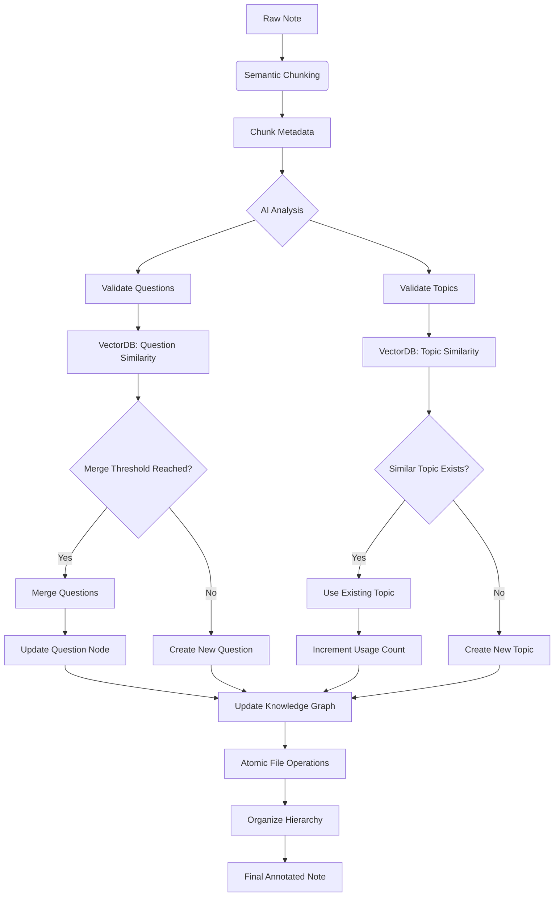

# Voltaire ✍️⚡  
*"Judge your notes by their questions, not just their answers."*

An **AI-powered Obsidian plugin** that transforms passive notes into an active knowledge network through semantic interrogation and dynamic organization.

---

## 🔍 Core Philosophy  
Voltaire embodies three Enlightenment principles for modern thinking:  
1. **Atomic Inquiry** - Each note becomes a discrete "thought experiment"  
2. **Socratic Organization** - AI-generated questions reveal hidden connections  
3. **Emergent Taxonomy** - Topics self-organize through semantic resonance  

---

## 🚀 Features  
### Cognitive Architecture  
- **Question-First Indexing** - Every note originates from an AI-generated question  
- **Semantic DNA** - Chunks maintain positional metadata for context preservation  
- **Adaptive Merging** - Related questions intelligently consolidate  

### Intelligent Processing Pipeline


### Precision Controls  
- **Tunable Thresholds** for:  
  - Topic affinity  
  - Question similarity  
  - Category clustering  
- **Model Selection** (Supports GPT-3.5 and GPT-4)  

---

## 🛠 Installation  
1. Install via Obsidian's Community Plugins  
2. Secure API keys for:  
   - [OpenAI](https://platform.openai.com/api-keys)  
   - [Pinecone](https://docs.pinecone.io/guides/projects/manage-api-keys)  
3. Configure in the settings:  

  

---

## 🧠 Usage Patterns  

### Command Matrix  
| Action | Command | Outcome |
|--------|--------|---------|
| **Process Notes** | 'voltaire-run' | Initiates full analysis pipeline |
| **Reset State** | 'voltaire-reset' | Clears processing flags |
| **Force Rebuild** | 'voltaire-rebuild' | Bypasses cache for full reprocess |

### Workflow Example  
1. Add raw notes to `/<raw_notes>`  
2. Run processing:  
   ```mermaid
   graph LR
   A[Raw Text] --> B(Chunking)
   B --> C(Question Extraction)
   C --> D(Topic Assignment)
   D --> E[Organized Output]
   ```
3. Discover connections in `/<knowledge_base>`  

  
*Automatically generated knowledge structure*

---

## 🏛 Philosophical Foundations  
Voltaire operationalizes:  
- **Luhmann's Zettelkasten** through AI-assisted linking  
- **Socratic Dialogue** via automated questioning  
- **Enlightenment Values** with computational rigor  

---

## 📜 Changelog  
### v0.5.0 (Current)  
- Added multi-tier topic nesting  
- Implemented question merging logic  
- Introduced atomic file operations 
- Cross-note question synthesis 
